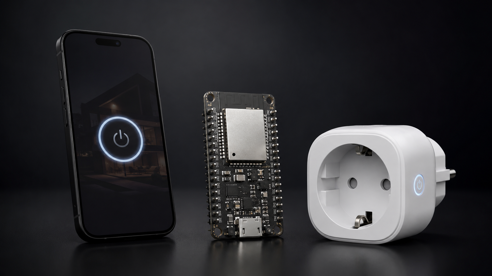
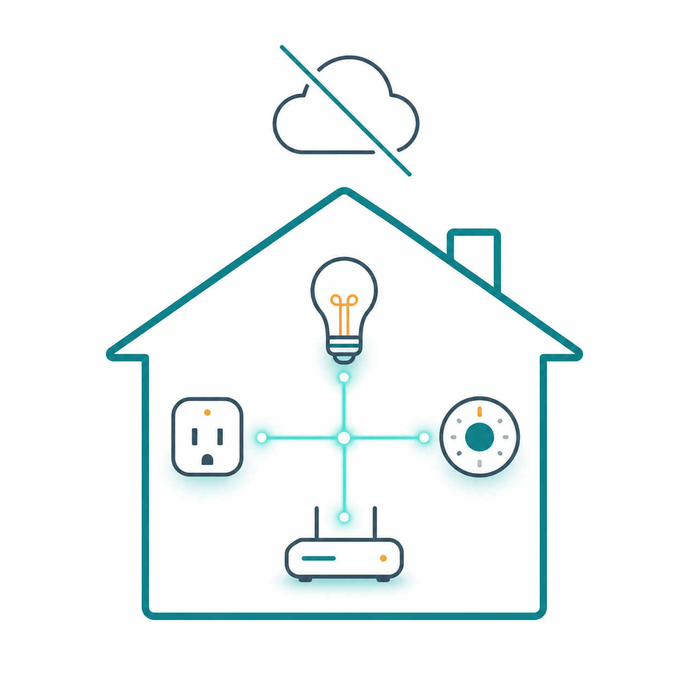

<p align="center">
  
</p>

# Tuya ESP32 HomeKit Bridge

Turn a Tuya / Smart Life Wi-Fi plug into a local Apple HomeKit Outlet without reflashing or opening the plug.



This project uses:

- Python + TinyTuya to discover and verify local Tuya control first
- ESP32 + HomeSpan to expose the plug to Apple HomeKit
- local LAN control for switching on/off

The original Tuya / Smart Life firmware stays on the plug.

In plain language: the ESP32 behaves like a small translator. Apple Home talks to the ESP32 using HomeKit, and the ESP32 talks to the Tuya plug using the plug's local Tuya protocol.

## Start Here

If you already know Python, Arduino IDE, ESP32 flashing, and HomeKit pairing, follow the phases in this README.

If you are new to those tools, use the beginner walkthrough first:

[Beginner Guide](docs/beginner-guide.md)

The beginner guide explains each step in smaller pieces, including what to install, what values to copy, what should happen after every step, and when to stop instead of guessing.

For maintainers preparing a GitHub release, use:

[Release Checklist](docs/release-checklist.md)

## Current Status

Release candidate for `v0.1.0`:

- tested with one Tesla Smart Plug / Tuya protocol `3.4`
- local Python control works through TinyTuya
- ESP32 local Tuya POC works for `status`, `on`, and `off`
- HomeSpan sketch exposes the plug as an Apple HomeKit `Outlet`

This is still experimental. Treat the first release as a working reference build for one known device, not as a universal Tuya bridge.

## Visual Overview



The intended flow is local: HomeKit talks to the ESP32, and the ESP32 talks to the Tuya plug on your Wi-Fi network.

## What This Is

This is an experimental local bridge for existing Tuya Wi-Fi plugs. The ESP32 joins your Wi-Fi network, talks directly to the Tuya plug over the LAN, and exposes a HomeKit `Outlet` accessory via HomeSpan.

The proven test setup was:

- [Tesla Smart Plug](https://www.alza.cz/tesla-smart-plug-d6775568.htm)
- Tuya / Smart Life Wi-Fi plug
- Tuya protocol `3.4`
- relay datapoint `1`
- [ESP32 development board](https://dratek.cz/arduino-platforma/1581-esp-32s-esp32-esp8266-development-board-2.4ghz-dual-mode-wifi-bluetooth-antenna-module.html)

Other Tuya devices may work, but they must be verified first. Do not assume protocol version, datapoints, or local-key behavior.

## What This Is Not

- It does not flash the Tuya plug.
- It does not require opening the plug.
- It does not use Tuya cloud for HomeKit on/off commands.
- It is not a universal Tuya device bridge yet.
- It is not intended for critical loads or safety-critical switching.

## Hardware

- ESP32 development board
- Existing Tuya / Smart Life Wi-Fi plug
- 2.4 GHz Wi-Fi network
- A safe test load, such as a small lamp

Optional but strongly recommended:

- DHCP reservation for the Tuya plug
- DHCP reservation for the ESP32

DHCP reservation means telling your router to always give the same IP address to the same device. This prevents the bridge from breaking when the router changes the plug's IP address.

## Project Structure

```text
.
├── .env.example
├── requirements.txt
├── docs/
│   ├── beginner-guide.md
│   └── release-checklist.md
├── scripts/
│   ├── scan_devices.py
│   ├── test_plug.py
│   └── export_esp32_secrets.py
└── esp32/
    ├── tuya_local_poc/
    └── homespan_tuya_outlet/
```

## Safety

Tuya plugs switch mains voltage. Test with a small non-critical load first.

Do not use this project for:

- heaters without independent thermal protection
- medical equipment
- pumps or appliances where unexpected switching can cause damage
- any load that would be dangerous after a reboot, Wi-Fi outage, or software bug

## Secret Handling

Never commit:

- `.env`
- `tinytuya.json`
- `devices.json`
- `tuya-raw.json`
- `snapshot.json`
- `esp32/**/secrets.h`

These files are ignored by `.gitignore` because they can contain device IDs, cloud credentials, Wi-Fi passwords, or Tuya local keys.

If you pasted a Tuya Access Secret somewhere public, rotate it in the Tuya IoT Platform.

## Phase 1: Verify Local Tuya Control

Do this before flashing the ESP32. If local TinyTuya control does not work, HomeKit will not work reliably either.

### macOS / Linux Setup

```bash
python3 -m venv .venv
source .venv/bin/activate
python -m pip install --upgrade pip
python -m pip install -r requirements.txt
```

### Scan LAN for Tuya Devices

If you already know the plug IP, pass it as `--target-ip`.

Run:

```bash
python scripts/scan_devices.py --target-ip 192.168.1.123
```

Look for:

- plug IP address
- Device ID
- Tuya protocol version
- product information

Confirm the IP address in your router/DHCP lease table. TinyTuya may not always report the MAC address.

### Get local_key

You need the plug's `local_key`.

This is a 16-character device secret used by the local Tuya protocol. Without it, the ESP32 cannot decrypt or send local commands.

Common route:

1. Open [Tuya IoT Platform](https://iot.tuya.com/).
2. Create a Tuya IoT account if you do not already have one.
3. Create a Tuya IoT cloud project if you do not already have one.
4. Link your Smart Life / Tuya app account.
5. Add the device to the project.
6. Use TinyTuya wizard or Tuya IoT Platform API Explorer to retrieve `local_key`.

You need both a Tuya IoT account and a cloud project. The Smart Life mobile-app account alone is not enough to access the API Explorer.

TinyTuya wizard:

```bash
python -m tinytuya wizard
```

Tuya IoT Platform API Explorer:

1. Open [Tuya IoT Platform](https://iot.tuya.com/).
2. Open your cloud project.
3. Select the correct data center, for example `Central Europe Data Center`.
4. Go to `API Explorer`.
5. Select `IoT Core`.
6. Open `Device Management`.
7. Choose `Query Device Details`.
8. Enter the device ID found by TinyTuya scan.
9. Click `Submit Request`.
10. In the JSON response, copy the `result.local_key` value into your local `.env`.

The API Explorer page can also show a generated `curl` command. Treat both the `curl` command and the JSON response as secrets because they may contain:

- `local_key`
- `client_id`
- request signature
- access token
- location and device metadata

Do not paste the API Explorer response, request URL, or generated `curl` command into issues, README files, screenshots, or commits unless all secrets are redacted.

Tuya sometimes requires an active IoT Core / Cloud Development plan to retrieve device details. The cloud is used only to get `local_key`; switching is local after that.

### Configure .env

```bash
cp .env.example .env
```

Fill:

```text
DEVICE_ID=your_device_id
DEVICE_IP=your_plug_lan_ip
LOCAL_KEY=your_16_byte_local_key
DEVICE_VERSION=3.4
```

Use the version discovered by scan. Do not guess.

### Test Status and Switching

Read status first:

```bash
python scripts/test_plug.py status
```

Then test switching:

```bash
python scripts/test_plug.py on
python scripts/test_plug.py off
```

For the tested plug, the relay datapoint was:

```text
dps["1"] = true / false
```

If your device uses a different datapoint, update the ESP32 configuration before flashing.

## Phase 2: ESP32 Local Tuya POC

Use this sketch before HomeSpan:

```text
esp32/tuya_local_poc/tuya_local_poc.ino
```

Generate local ESP32 secrets:

```bash
python scripts/export_esp32_secrets.py
```

Edit:

```bash
nano esp32/tuya_local_poc/secrets.h
```

Fill Wi-Fi:

```cpp
#define WIFI_SSID "..."
#define WIFI_PASSWORD "..."
```

Flash the sketch, open Serial Monitor at `115200`, and test:

```text
status
on
off
```

Only continue when this works reliably.

This step deliberately avoids HomeKit. It proves that the ESP32 can control the plug locally before adding another layer.

## Phase 3: HomeKit Outlet with HomeSpan

Use:

```text
esp32/homespan_tuya_outlet/homespan_tuya_outlet.ino
```

Install in Arduino IDE:

- ESP32 board support
- HomeSpan library

Generate or update `secrets.h`:

```bash
python scripts/export_esp32_secrets.py
```

Edit:

```bash
nano esp32/homespan_tuya_outlet/secrets.h
```

Fill:

```cpp
#define WIFI_SSID "..."
#define WIFI_PASSWORD "..."
#define HOMEKIT_ACCESSORY_NAME "Tuya HomeKit Outlet"
```

Flash the sketch, then set the HomeKit pairing code before adding the ESP32 in Apple Home.

### Set HomeKit Pairing Code

For security, do not hardcode the HomeKit pairing code in the sketch.

After flashing, open Serial Monitor at `115200` and use the HomeSpan CLI command:

```text
S 11223344
```

Rules:

- the code must be exactly 8 digits
- type it without hyphens in Serial Monitor
- write it down before pairing
- use your own code, not `11223344`

When Apple Home asks for the setup code, enter it in the usual HomeKit format. For example:

```text
112-23-344
```

for the Serial command `S 11223344`.

## How It Maps to HomeKit

The HomeSpan sketch exposes:

- HomeKit service: `Outlet`
- HomeKit `On`: Tuya relay DPS `1`
- HomeKit `OutletInUse`: same value as relay state

`OutletInUse` is currently not real power detection. It only means the relay is on.

The sketch polls local Tuya status every 30 seconds so HomeKit can notice changes made from Smart Life or the physical button.

## Stability Notes

For long-term use:

- reserve a fixed LAN IP for the plug
- reserve a fixed LAN IP for the ESP32
- keep the ESP32 close enough to the Wi-Fi access point
- use a stable USB power supply
- test for several days before relying on it

The biggest unknown is Tuya firmware behavior. A future plug firmware update could change local protocol behavior.

## Troubleshooting

### TinyTuya finds the device but status fails

Check:

- `LOCAL_KEY`
- `DEVICE_VERSION`
- plug IP address
- same LAN / VLAN
- Smart Life app is not holding a conflicting local session

### HomeKit controls the ESP32 but the plug does not switch

Go back to the ESP32 local POC and verify `status/on/off` over Serial Monitor.

### HomeKit shows stale state

The sketch polls every 30 seconds. Wait for one poll cycle.

If state never updates, check Serial Monitor for Tuya status/decrypt errors.

### Pairing fails

If the ESP32 was paired before, clear HomeSpan pairing data using the HomeSpan Serial CLI, then pair again.

## References

- [TinyTuya](https://github.com/jasonacox/tinytuya)
- [HomeSpan](https://github.com/HomeSpan/HomeSpan)
- [HomeSpan Reference](https://github.com/HomeSpan/HomeSpan/blob/master/docs/Reference.md)
- [HomeSpan User Guide](https://github.com/HomeSpan/HomeSpan/blob/master/docs/UserGuide.md)

## Contact

For questions, bug reports, or compatible-device reports, open a GitHub issue:

[github.com/Lisejnik/tuya-esp32-homekit-bridge/issues](https://github.com/Lisejnik/tuya-esp32-homekit-bridge/issues)

When opening an issue, include:

- device model
- Tuya protocol version
- relay datapoint if known
- ESP32 board type
- sanitized Serial Monitor logs

Do not include `local_key`, Wi-Fi passwords, Tuya Access Secret, generated `curl` commands, or unredacted API Explorer responses.

## Publishing Your Fork

Before pushing to GitHub, verify that local secrets are ignored:

```bash
git status --ignored --short
```

These files must not appear as tracked files:

```text
.env
tinytuya.json
devices.json
tuya-raw.json
snapshot.json
esp32/**/secrets.h
```

If you accidentally committed a secret, remove it from git history and rotate the affected key.

## Status

Working prototype:

- local TinyTuya control verified
- ESP32 Tuya `3.4` local POC verified
- HomeSpan HomeKit Outlet verified

Still experimental:

- broader Tuya device support
- automatic datapoint discovery
- robust recovery for every network edge case
