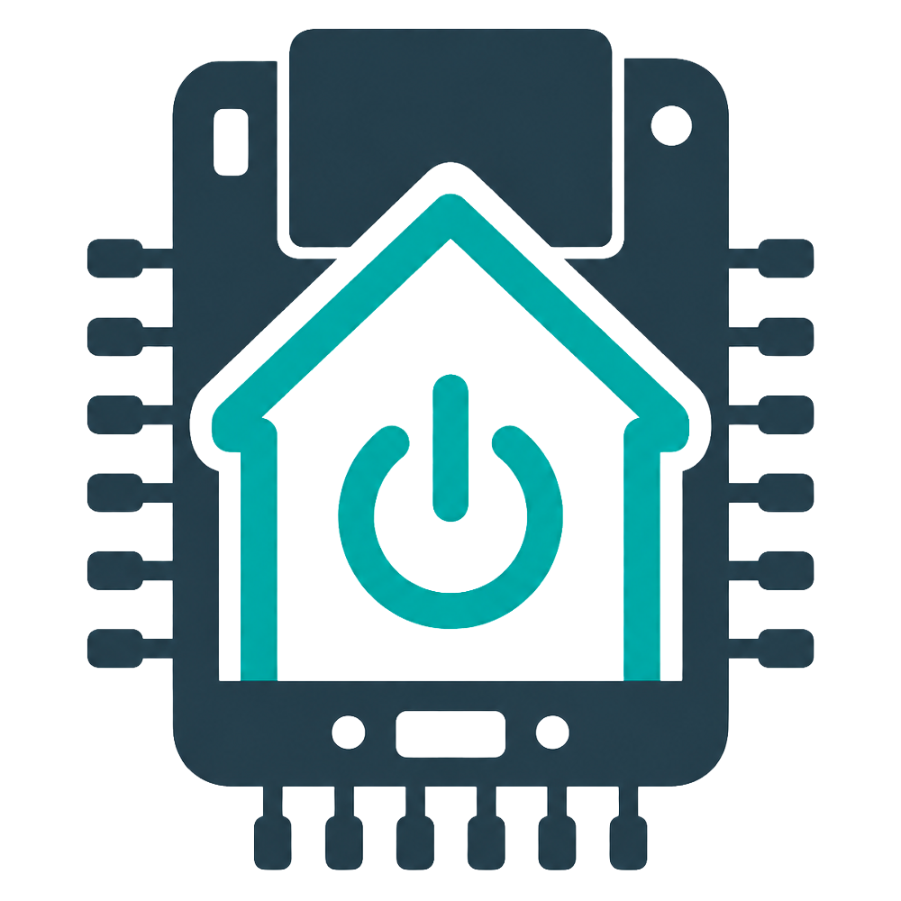

# Beginner Guide

This guide is for people who can follow careful steps but are not yet comfortable with Python, ESP32 flashing, Tuya local keys, or HomeKit development.


Do not skip Phase 1. The Python test proves whether your Tuya plug can be controlled locally. If Phase 1 fails, the ESP32 and HomeKit steps will also fail.

## What You Are Building

You will keep the original Tuya / Smart Life plug firmware. Nothing is flashed to the plug.

The ESP32 becomes a small bridge:

```text
Apple Home app -> ESP32 HomeKit accessory -> Tuya plug over local Wi-Fi
```



The Tuya cloud is only used once to get the plug's `local_key`. After that, on/off control is local on your LAN.

## What You Need

- A Tuya / Smart Life Wi-Fi plug already added in the Smart Life or Tuya mobile app
- An ESP32 development board
- A USB cable that supports data, not only charging
- A Mac, Linux computer, or Windows computer with Python and Arduino IDE
- A 2.4 GHz Wi-Fi network used by the plug and ESP32
- A small safe test load, such as a lamp
- Apple Home app on iPhone, iPad, or Mac

Recommended:

- Reserve a fixed IP address for the plug in your router
- Reserve a fixed IP address for the ESP32 after the first successful test

## Important Safety Rules

Test with a low-power lamp first.

Do not use this project for heaters, pumps, medical devices, unattended appliances, or anything that could be dangerous if it turns on or off unexpectedly.

## Words You Will See

- `Device ID`: Tuya's identifier for your plug.
- `Device IP`: the plug's local network address, for example `192.168.1.123`.
- `local_key`: a 16-character secret used by the local Tuya protocol.
- `Tuya protocol version`: usually `3.3`, `3.4`, or `3.5`; this project currently targets `3.4` on ESP32.
- `DPS`: Tuya datapoint. For the tested plug, relay on/off is DPS `1`.
- `secrets.h`: a local Arduino file used only by the ESP32 Tuya local POC. The HomeKit sketch uses the web setup wizard instead.

## Phase 0: Download the Project

Open Terminal and clone the repository:

```bash
git clone https://github.com/Lisejnik/tuya-esp32-homekit-bridge.git
cd tuya-esp32-homekit-bridge
```

If you downloaded a ZIP from GitHub instead, unzip it and open Terminal inside the unzipped folder.

## Phase 1: Prepare Python

Create a Python virtual environment:

```bash
python3 -m venv .venv
source .venv/bin/activate
python -m pip install --upgrade pip
python -m pip install -r requirements.txt
```

On Windows PowerShell, activation is usually:

```powershell
.\.venv\Scripts\Activate.ps1
```

You should now be able to run:

```bash
python --version
```

## Phase 2: Find the Plug on Your Network

If you know the plug IP address from your router, run:

```bash
python scripts/scan_devices.py --target-ip 192.168.1.123
```

Replace `192.168.1.123` with your plug IP.

Write down:

- plug IP address
- Device ID
- Tuya protocol version

If no device is found:

- make sure your computer and plug are on the same network
- close the Smart Life / Tuya app and try again
- check that the plug is powered on
- check the plug IP address in your router

## Phase 3: Get the Tuya local_key

You need a Tuya IoT Platform account. The Smart Life mobile-app account alone is not enough.

High-level steps:

1. Open [Tuya IoT Platform](https://iot.tuya.com/).
2. Create a cloud project.
3. Link your Smart Life / Tuya app account to the project.
4. Open API Explorer in the project.
5. Use `IoT Core` -> `Device Management` -> `Query Device Details`.
6. Enter the Device ID from the scan.
7. Copy `result.local_key`.

Treat the `local_key`, generated API Explorer `curl` command, access tokens, and Tuya Access Secret as passwords.

## Phase 4: Create .env

Copy the example file:

```bash
cp .env.example .env
```

Open `.env` in a text editor and fill your values:

```text
DEVICE_ID=your_device_id
DEVICE_IP=192.168.1.123
LOCAL_KEY=your_16_character_local_key
DEVICE_VERSION=3.4
```

For the ESP32 sketches in this repository, `DEVICE_VERSION` must be `3.4`.

## Phase 5: Test Local Tuya Control from Python

Read status first:

```bash
python scripts/test_plug.py status
```

If status works, test switching:

```bash
python scripts/test_plug.py on
python scripts/test_plug.py off
```

Stop here if status or switching fails. Fix Python local control before continuing.

Most common causes:

- wrong `LOCAL_KEY`
- wrong `DEVICE_VERSION`
- wrong plug IP address
- computer and plug are not on the same LAN
- plug uses a different relay DPS than `1`

## Phase 6: Install Arduino IDE Tools

Install:

- [Arduino IDE](https://www.arduino.cc/en/software)
- ESP32 board support in Arduino IDE
- HomeSpan library in Arduino IDE Library Manager

The first ESP32 POC does not need HomeSpan, but the final HomeKit sketch does.

## Phase 7: Generate ESP32 secrets.h

From the project root, run:

```bash
python scripts/export_esp32_secrets.py
```

This creates:

```text
esp32/tuya_local_poc/secrets.h
```

Open this generated file later if needed, but do not commit it.

## Phase 8: Flash the ESP32 Tuya Local POC

In Arduino IDE, open:

```text
esp32/tuya_local_poc/tuya_local_poc.ino
```

Edit the generated file:

```text
esp32/tuya_local_poc/secrets.h
```

Fill your Wi-Fi:

```cpp
#define WIFI_SSID "your_wifi_name"
#define WIFI_PASSWORD "your_wifi_password"
```

Select your ESP32 board and port, then upload the sketch.

Open Serial Monitor at `115200` baud and type:

```text
status
on
off
```

Only continue when all three commands work reliably.

## Phase 9: Flash the HomeKit Outlet Sketch

In Arduino IDE, open:

```text
esp32/homespan_tuya_outlet/homespan_tuya_outlet.ino
```

For a common ESP32 Dev Module, select:

- Partition Scheme: `No OTA (2MB APP/2MB SPIFFS)`

The default partition can be too small for HomeSpan plus the setup page.

Upload the sketch and open Serial Monitor at `115200`.

On first boot, the ESP32 should start setup mode and print:

```text
Setup AP SSID: TuyaHomeKit-Setup
Setup URL: http://192.168.4.1
```

## Phase 10: Configure the ESP32 from the Web Page

On your phone or computer, connect to this Wi-Fi network:

```text
TuyaHomeKit-Setup
```

Use the setup Wi-Fi password printed in Serial Monitor. It is randomly generated each time setup mode starts.

Then open:

```text
http://192.168.4.1/
```

Most phones and computers should offer the setup page automatically after joining `TuyaHomeKit-Setup`. If the captive portal window does not appear, open the address above manually.

Fill the setup form:

- Wi-Fi SSID
- Wi-Fi password
- local dashboard hostname: `tuya-homekit`
- Tuya plug IP address
- Tuya device ID
- Tuya local key
- Tuya protocol version: `3.4`
- relay DPS: `1`
- HomeKit accessory name
- HomeKit type: `Outlet`
- HomeKit pairing code: your own 8-digit code, or blank for HomeSpan default `466-37-726`
- polling interval: `30`

The v2.1 setup page is split into steps:

1. Wi-Fi setup
2. Find Tuya device
3. Enter Tuya credentials
4. Test connection
5. HomeKit settings
6. Save and reboot

Use `Simple` mode if you only want the normal setup fields. Switch to `Advanced` when you need protocol version, relay DPS, polling interval, hostname, DPS scan, diagnostics, or backup/import tools.

The **Find Tuya devices** button is experimental. It looks for devices with Tuya-like local ports open on the same network. If it finds something, use **Use this IP**, then still enter the correct Device ID and `local_key`.

The **Test Tuya connection** button gives more detail than just success or failure. It can show whether the IP and port are reachable, whether the local key/protocol look wrong, whether the relay DPS was found, and how long the response took.

The **Scan DPS** button is read-only. It lists Tuya datapoints returned by the plug. If you see a boolean datapoint that clearly follows the plug on/off state, you can use it as the relay DPS. The scanner does not turn unknown datapoints on or off.

The setup page uses plain HTTP on the temporary ESP32 setup network. Stay near the ESP32 while configuring it and save valid settings so setup mode turns off. Wi-Fi passwords and Tuya local keys are stored in ESP32 Preferences in plaintext, so use an IoT or guest Wi-Fi network if possible. If you open setup mode later, saved Wi-Fi passwords and Tuya local keys are not displayed; leave those fields blank to keep the saved values.

Use **Test Tuya connection** if you want to verify the values before saving.

Click **Save and restart**.

After restart, the ESP32 should connect to your normal Wi-Fi and start HomeSpan.

If it cannot connect to Wi-Fi, it will return to setup mode.

When the ESP32 starts normally, open the friendly local dashboard URL:

```text
http://tuya-homekit.local:8080/
```

If you changed the hostname in setup, replace `tuya-homekit` with your chosen hostname.

Serial Monitor also prints a fallback IP URL like:

```text
Admin URL: http://192.168.1.50:8080
```

Open that address from the same Wi-Fi network if you need to edit saved settings later. The admin dashboard can test Tuya connection, scan DPS values, restart the ESP32, clear bridge configuration, and clear HomeKit pairing on the ESP32.

The dashboard also shows current HomeKit, Tuya and network status:

- health status, reason, last update and suggested fix
- HomeKit name, type, relay state and polling interval
- Tuya IP, protocol, relay DPS, last response, latency and failed poll count
- Wi-Fi SSID, ESP32 IP, local hostname, dashboard URL, signal strength, uptime and free heap
- a small diagnostics log with recent Wi-Fi, HomeSpan and Tuya events

You can add the dashboard to a phone home screen like a local web app. This is still just the ESP32 web dashboard, not a native mobile app.

Backup:

- **Export config** downloads `tuya-homekit-bridge-config.json`.
- Wi-Fi password and Tuya `local_key` are excluded by default.
- Use **Include sensitive values** only for a private full backup. Anyone with that file may be able to access your Wi-Fi or control your Tuya plug.

Restore:

- Paste or upload a JSON config.
- Click **Preview import** first.
- If the preview is correct, click **Apply import and restart**.
- If the JSON does not contain secrets, the ESP32 keeps the saved Wi-Fi password and Tuya local key when possible.

The admin page is plain local HTTP without login, so use it only on a trusted LAN or IoT network. Do not expose it to the internet.

Reset options:

- To edit settings, open the admin URL and save new values.
- To clear only Wi-Fi and Tuya settings, use **Clear saved config** on the admin/setup page.
- To clear HomeKit pairing, use **Clear HomeKit pairing** on the admin page and remove the accessory in Apple Home too.
- To restart the ESP32, press **EN**.
- To enter Setup Mode without erasing saved settings, hold **BOOT / GPIO0** for about 5 seconds.
- To start fully from scratch, hold **BOOT / GPIO0** for about 15 seconds. This clears bridge configuration, HomeKit pairing data, and the HomeKit device ID, then restarts into setup mode.

Holding BOOT while the ESP32 starts uses the same timing: release after 5 seconds for Setup Mode, or keep holding for 15 seconds for Factory Reset. On some ESP32 boards, holding BOOT too early enters flashing mode instead; if that happens, release BOOT and reset again.

Status LED:

- During setup mode, the ESP32 LED blinks quickly.
- After Wi-Fi connects successfully, the LED blinks slowly 10 times and then turns off.
- During normal running, after successful HomeKit pairing, the LED glows very dimly.
- If Wi-Fi disconnects or the Tuya plug does not respond, the LED blinks a dim SOS pattern.

The default status LED pin is `GPIO2`, which matches many ESP32 Dev Module boards. Some boards do not have a built-in LED or use a different pin.

## Phase 11: Set HomeKit Pairing Code

The HomeKit pairing code is the 8-digit code Apple Home asks for when adding the accessory. It is not your Wi-Fi password and it is not the temporary setup Wi-Fi password.

The easiest option is to enter your own 8-digit code in the setup page before saving. Write it down.

If you left the field blank and never changed HomeSpan's code before, the fallback default is:

```text
466-37-726
```

You can also set a code in Serial Monitor:

```text
S 11223344
```

Use your own code, not the example. Type it without hyphens and write it down.

Apple Home displays HomeKit codes with hyphens. For example, `S 11223344` becomes:

```text
112-23-344
```

## Phase 12: Add to Apple Home

Open Apple Home and add a new accessory.

If there is no QR code, choose the option to add manually and enter your HomeKit code.

After pairing:

- turn the outlet on from Apple Home
- turn it off from Apple Home
- press the physical plug button and wait up to 30 seconds for HomeKit state to update

If you later change the HomeKit type from Outlet to Light or Switch, remove the accessory in Apple Home, click **Clear HomeKit pairing** on the ESP32 admin page, restart, and add it again.

## When to Open a GitHub Issue

Open an issue if Python control works but ESP32 or HomeKit control does not.

Include:

- plug model
- ESP32 board type
- Tuya protocol version
- relay DPS if known
- sanitized Serial Monitor logs

Do not include:

- `local_key`
- Wi-Fi password
- Tuya Access Secret
- generated API Explorer `curl` command
- screenshots showing tokens or secrets
